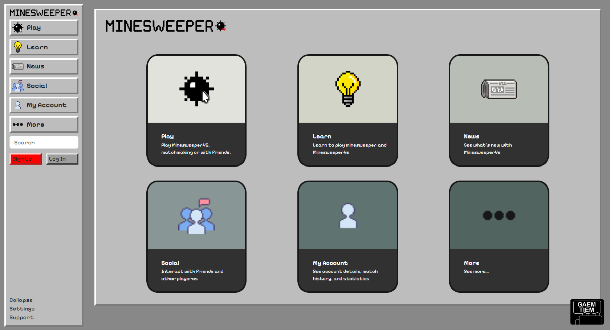
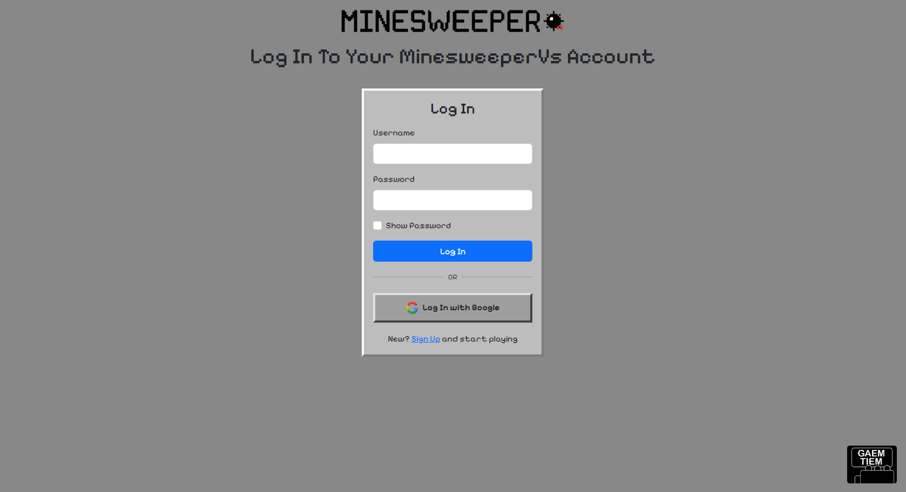
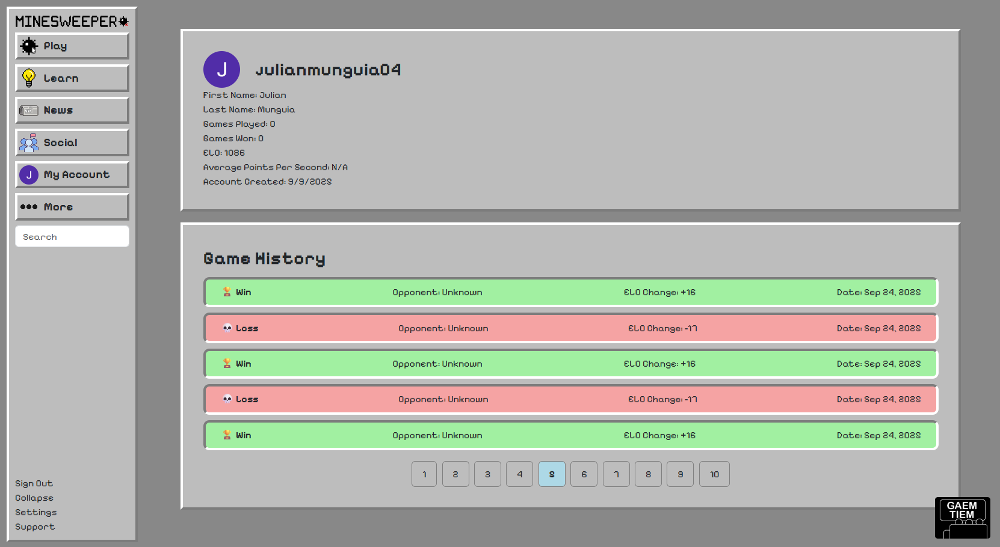
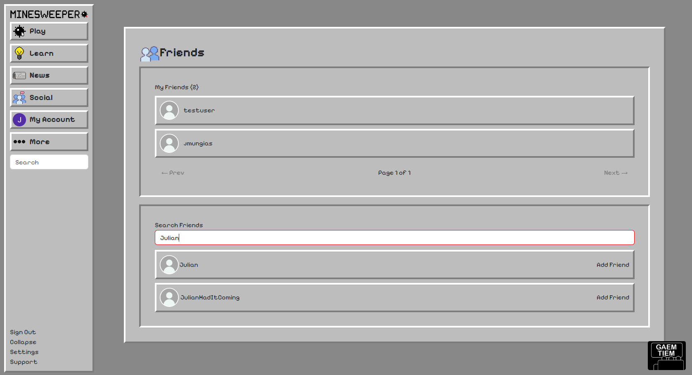
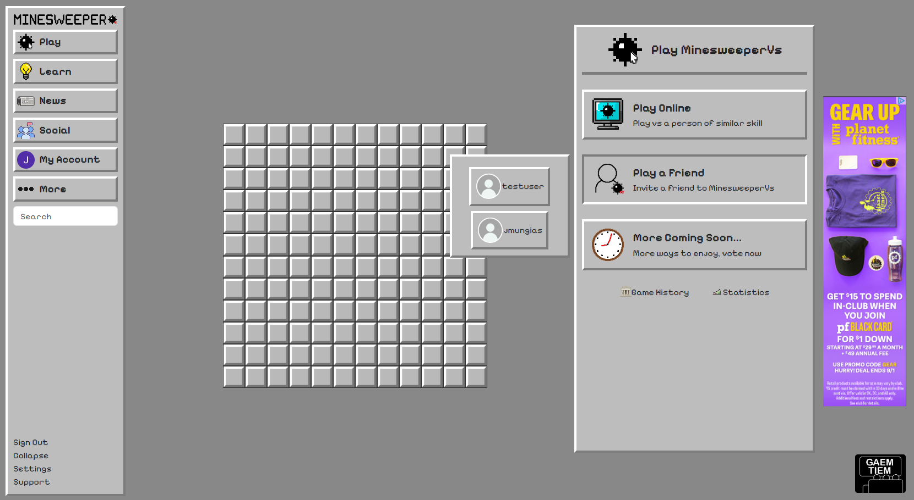
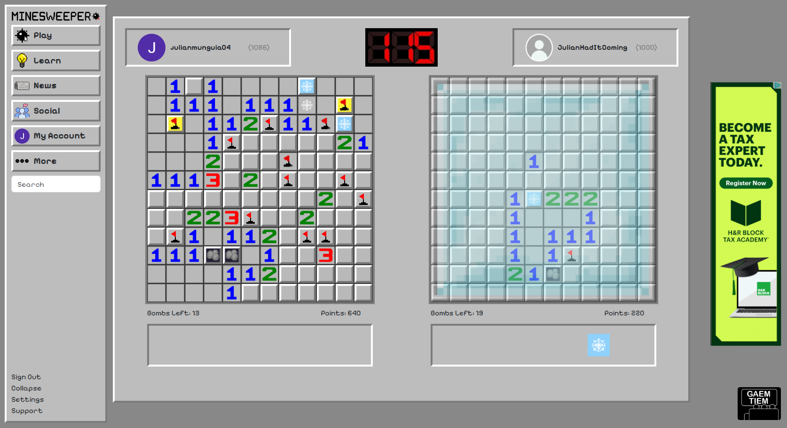

# MinesweeperVs

**MinesweeperVs** is an exciting multiplayer spin on the classic Minesweeper game. Players compete head-to-head in real time, using unique power-ups and strategic moves to outsmart their opponent. Matches are point-based and time-driven, rewarding both speed and accuracy. Beyond the gameplay, MinesweeperVs includes a rich social experience: challenge friends, climb global and friends-only leaderboards, and track your progress and ranking over time.

---

## 🧰 Tech Stack


---

## ⚙️ Technical Features and Gameplay 🕹️

### MinesweeperVs
MinesweeperVs is a real-time competitive multiplayer game built with Next.js and React on the frontend and Node.js on the backend. Real-time gameplay and player synchronization are powered by Socket.IO, game state and ephemeral data are cached in Redis for low-latency updates, and persistent user & match data are stored in PostgreSQL.


### 🔐 Sign Up and Login
Users can sign up or log in using either their email and username or Google authentication. Passwords are securely hashed using bcrypt before being stored in the PostgreSQL database to ensure data protection.
Upon successful login, the server generates a JWT (JSON Web Token), which is stored client-side and used to maintain a secure session — allowing users to stay logged in and authenticated across the app.


### 🧾 Account
Users can view their match history, track performance stats, and monitor their ELO ranking over time. All player data and match results are stored in PostgreSQL, while frequently accessed stats are cached in Redis for faster load times.


### 👥 Social
Users can add friends, send messages, and challenge each other to matches. Friend data and chat history are stored securely in PostgreSQL, while active chats and online presence are managed through Redis for real-time updates and low latency.


### ⚔️ Matchmaking
Players can search for a game through the Redis matchmaking queue, which pairs them against other available players in real time. Alternatively, they can invite friends directly to a private match. Redis handles active match sessions and player status, ensuring smooth and instant connections.


### 🎮 Gameplay
After a match is made, players go head-to-head to clear their Minesweeper boards, using power-ups and special abilities to gain an advantage or disrupt their opponent.

#### ⚡ Power-Ups & Abilities
  * Freeze: Temporarily freezes the opponent’s board, preventing them from making moves.
  * Flag Reveal: Reveals 3 random unflagged bombs on your own board.
  * Smoke Screen: Covers all revealed numbers on the opponent’s board, making it harder to track progress.
  * Clicker: Allows a one-time click on the opponent’s board, potentially hitting a bomb.
#### 🏆 Scoring & Match Outcome
  * Points are awarded for correctly revealed safe tiles and flagged bombs.
  * Hitting bombs reduce points.
  * The winner is determined by highest points at the end of the match.
  * ELO ranking is updated based on the match outcome.
  * Full match history is stored in PostgreSQL, with active game states and stats cached in Redis for fast access.

## 🛠️ Local Setup

Redis Download
https://github.com/microsoftarchive/redis/releases?utm_source=chatgpt.com

PostgreSQL Download
https://www.postgresql.org/download/

### 1. Clone the repository

```bash
git clone https://github.com/yourusername/minesweepervs.git
cd minesweepervs
```

### 2. Install dependencies

```bash
npm install
```

### 3. Create a `.env` file

Create a `.env` file in the root of your project and add the following:

```env
POSTGRES_HOST
POSTGRES_PORT
POSTGRES_USER
POSTGRES_PASSWORD
POSTGRES_DB
JWT_SECRET

FRONTENDURL
NEXT_PUBLIC_API_URL

GOOGLE_CLIENT_ID
GOOGLE_CLIENT_SECRET

REDIS_HOST
REDIS_PORT
```

### 4. Start server: next.js + server to handle socket connections

```bash
npm run devStart
# or
yarn devStart
# or
pnpm devStart
# or
bun devStart
```

### 5. Open the app

Visit:

```
http://localhost:3000
```

## 🐳 Docker Setup
You can run MinesweeperVs locally using Docker Compose, which starts the Next.js app, PostgreSQL, and Redis all together.

### 1. Make sure Docker is installed
 * [Docker Desktop](https://www.docker.com/products/docker-desktop/) for Windows or macOS
 * [Docker Engine](https://docs.docker.com/engine/install/) for Linux

### 2. Docker Compose
Make sure your `docker-compose.yml` is set up with services for:
  * app: Next.js + Node.js server
  * postgres: PostgreSQL database
  * redis: Redis Caching

### 3. Start the stack
```bash
docker-compose up --build
```


